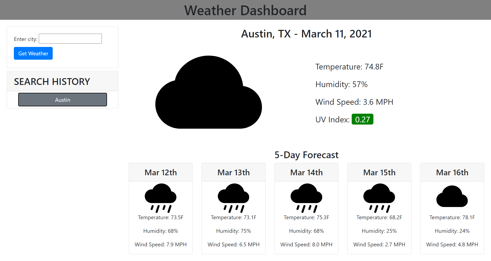

# Weather Dashboard <!-- omit in toc -->
- [Description](#description)
- [Demo](#demo)
- [Submission Requirements](#submission-requirements)
  - [User Story](#user-story)
  - [Acceptance Criteria](#acceptance-criteria)
  - [Grading Criteria](#grading-criteria)
## Description
For this project, I was tasked with creating a weather dashboard. The weather dashboard user has a search bar that a user can type a city name into and receive the current weather and a five day forecast.

This challenge required me to use new third-party APIs, one of which I had never used before. One of the first hurdles that I faced in this challenge was picking the weather APIs that I would eventually use, and then learn how to call and extract the data from the API. This was definitely the most complex challenge to date because it required the highest amount of third party frameworks, APIs, and libraries to execute. In the end I used bootstrap for layout and styling, moment.js for time and time formatting, and open weather for live weather data.
## Demo
A live version of the deployed application can be found [here](https://glendonintendo.github.io/challenge6-weather-dashboard/).

An image of the launched application can also be found below: 
## Submission Requirements
### User Story
```
AS A traveler
I WANT to see the weather outlook for multiple cities
SO THAT I can plan a trip accordingly
```
### Acceptance Criteria
```
GIVEN a weather dashboard with form inputs
WHEN I search for a city
THEN I am presented with current and future conditions for that city and that city is added to the search history
WHEN I view current weather conditions for that city
THEN I am presented with the city name, the date, an icon representation of weather conditions, the temperature, the humidity, the wind speed, and the UV index
WHEN I view the UV index
THEN I am presented with a color that indicates whether the conditions are favorable, moderate, or severe
WHEN I view future weather conditions for that city
THEN I am presented with a 5-day forecast that displays the date, an icon representation of weather conditions, the temperature, and the humidity
WHEN I click on a city in the search history
THEN I am again presented with current and future conditions for that city
```
### Grading Criteria
#### Technical Acceptance Criteria: 40% <!-- omit in toc -->
- [x] User can search for a city and is presented with current and future conditions for that city
- [x] Searched cities are saved in search history
- [x] Displayed content for a searched city include city name, date, icon represenation of weather conditions, temperature, humidity, wind speed, and UV index
- [x] UV index additionally are indicated with different colors indicating favorable, moderate and severe
- [x] Future weather conditions show 5-day forecast that displays date, icon represenation of weather conditions, temperatures and humidity
- [x] Cities saved in search history can be clicked again to show weather forecast
- [x] Application uses OpenWeather API to retrieve weather data
- [x] Application uses localStorage to store persistent data
#### Deployment: 32% <!-- omit in toc -->
- [x] Application deployed at live URL
- [x] Application loads with no errors
- [x] Application GitHub URL submitted
- [x] GitHub repository contains application code
#### Application Quality: 15% <!-- omit in toc -->
- [x] Application user experience is intuitive and easy to navigate
- [x] Application user interface style is clean and polished
- [x] Application resembles the mock-up functionality
#### Repository Quality: 13% <!-- omit in toc -->
- [x] Repository has a unique name
- [x] Repository follows best practices for file structure and naming conventions
- [x] Repository follows best practices for calls/id naming conventions, indentation, quality comments, etc.
- [x] Repository contains multiple descriptive commit messages
- [x] Repository contains quality README file with description, screenshot, and link to deployed application